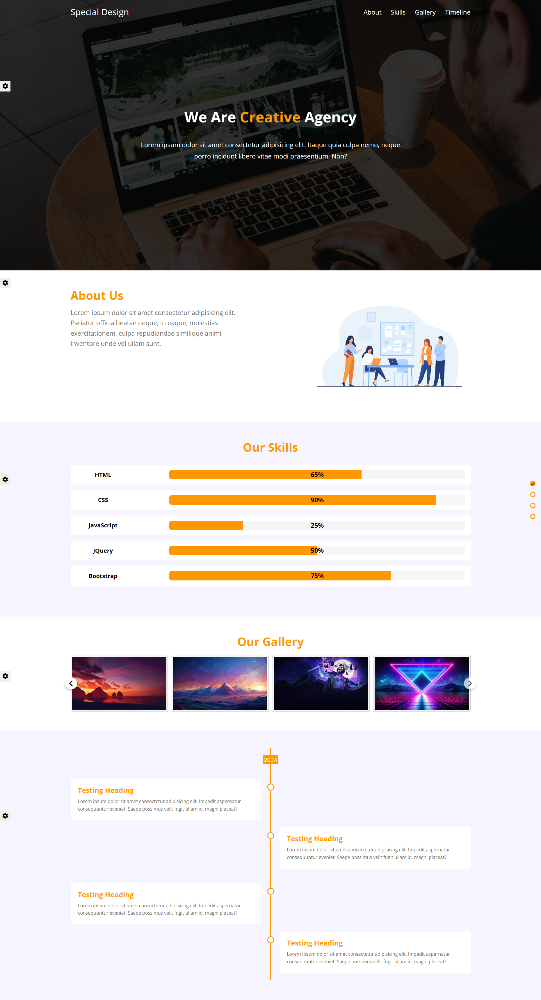

# Landing page

Landing web page to improve front-end skills

## Table of contents

- [Overview](#overview)
  - [Screenshot](#screenshot)
  - [Links](#links)
- [My process](#my-process)
  - [Built with](#built-with)

## Overview

### Screenshot

### Links

- Live Site URL: [Live preview](https://shady-mo.github.io/Landing-Page/)

## My process

### Built with

- HTML 5
- CSS 3
- Responsive design
- DOM JS
- BOM JS
